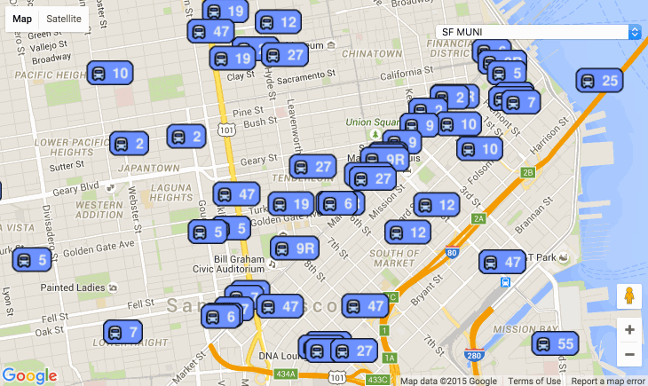

# Firebase Example - Where is my Bus

A map that tells you where your bus is, but not why it's late.

[wherebus.firebaseapp.com](https://wherebus.firebaseapp.com)

## Deploy Your Own

0. Clone this repo, or download the zip file
0. Sign up for a free Firebase account at [firebase.com](https://firebase.com).
0. Install the Bower components:
   `$ bower install`
0. Change `firebase.json` to match your Firebase. Install the Firebase [command line tools]().
0. Deploy to your firebase
   `$ firebase deploy`
